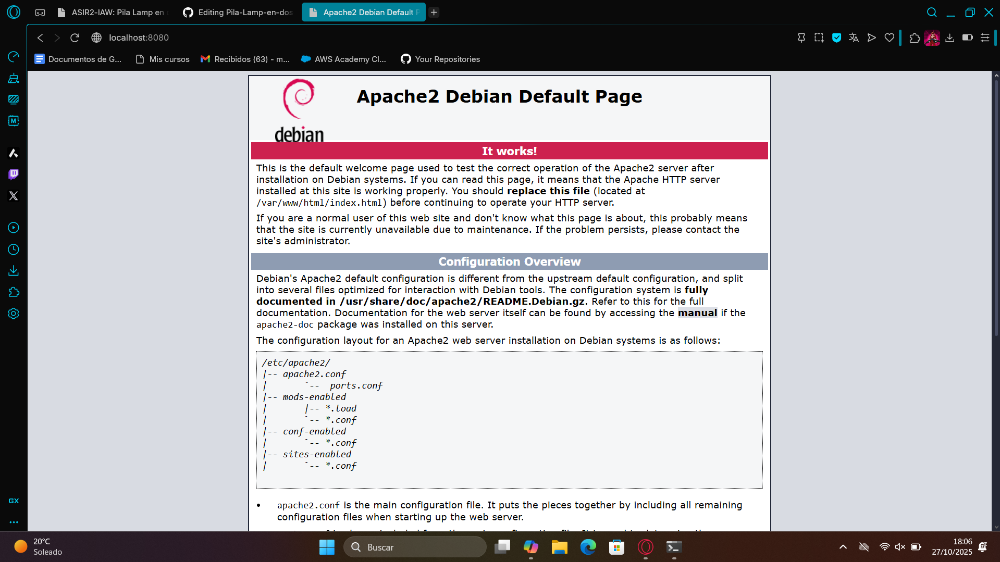
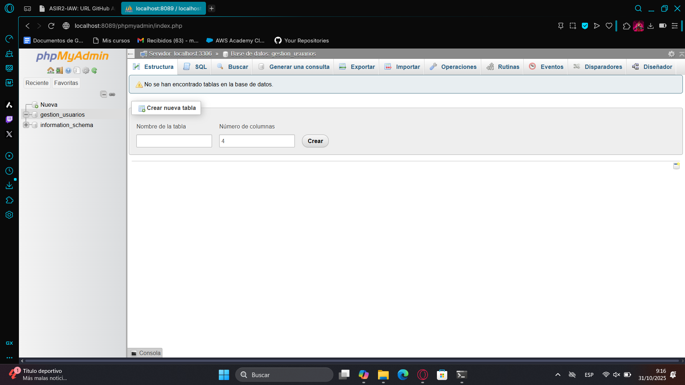

# Pila-Lamp-en-dos-niveles

# 🛠️ Infraestructura LAMP en Dos Niveles con Vagrant

Este proyecto implementa una infraestructura de dos niveles utilizando Vagrant y Debian 12. Se despliega una aplicación de gestión de usuarios descargada desde [IES Albarregas](https://informatica.iesalbarregas.com/mod/url/view.php?id=4382), separando los servicios web (Apache + PHP) y base de datos (MariaDB) en dos máquinas virtuales.

---

## 📦 Estructura del Proyecto


---

## 🧱 Arquitectura

- **MarioApache**: Servidor web con Apache, PHP y la aplicación.
  - Acceso a Internet vía NAT.
  - Reenvío de puertos: `localhost:8080 → VM:80`
- **MarioMysql**: Servidor de base de datos con MariaDB.
  - Sin acceso a Internet.
  - Comunicación interna por red privada (`192.168.33.11`)

---

## ⚙️ Vagrantfile

```ruby
  config.vm.define "MarioApache" do |apache|
    apache.vm.box = "debian/bookworm64"
    apache.vm.hostname = "MarioApache"
    apache.vm.network "forwarded_port", guest: 80, host: 8080
    apache.vm.network "private_network", ip: "192.168.33.10"
    apache.vm.provision "shell", path: "Apache.sh"
    apache.vm.network "public_network", bridge: "enp0s3"
  end


  config.vm.define "MarioMysql" do |mysql|
    mysql.vm.box = "debian/bookworm64"
    mysql.vm.hostname = "MarioMysql"
    mysql.vm.network "forwarded_port", guest: 3306, host: 8088
    mysql.vm.network "forwarded_port", guest: 80, host: 8089
    mysql.vm.network "private_network", ip: "192.168.33.11"
    mysql.vm.provision "shell", path: "Mysql.sh"
  end


#!/bin/bash
apt update
apt install -y apache2 php php-mysqli unzip wget

# Descargar y desplegar la aplicación
wget -O app.zip https://informatica.iesalbarregas.com/mod/url/view.php?id=4382
unzip app.zip -d /var/www/html/
chown -R www-data:www-data /var/www/html/
systemctl restart apache2


#!/bin/bash

# Actualizar repositorios
sudo apt update

# Instalar Apache, PHP, MariaDB y extensiones necesarias
sudo apt install -y apache2 php libapache2-mod-php mariadb-server php-mysql php-mbstring php-zip php-gd php-json php-curl

# Habilitar y arrancar servicios
sudo systemctl enable apache2
sudo systemctl start apache2
sudo systemctl enable mariadb || sudo systemctl enable mysql
sudo systemctl start mariadb || sudo systemctl start mysql

# Crear base de datos y usuario en MariaDB
mysql -u root <<EOF
CREATE DATABASE IF NOT EXISTS gestion_usuarios;
CREATE USER IF NOT EXISTS 'mario'@'%' IDENTIFIED BY 'abcd';
GRANT ALL PRIVILEGES ON gestion_usuarios.* TO 'mario'@'%';
FLUSH PRIVILEGES;
EOF

# Preconfigurar phpMyAdmin para instalacion silenciosa
echo "phpmyadmin phpmyadmin/dbconfig-install boolean false" | sudo debconf-set-selections
echo "phpmyadmin phpmyadmin/reconfigure-webserver multiselect apache2" | sudo debconf-set-selections

# Instalar phpMyAdmin sin interaccion
sudo apt install -y phpmyadmin

# Habilitar extensiones PHP necesarias
sudo phpenmod mbstring
sudo systemctl restart apache2

# Configurar acceso remoto a phpMyAdmin (opcional)
sudo sed -i 's/Require local/Require all granted/' /etc/apache2/conf-available/phpmyadmin.conf
sudo systemctl restart apache2

echo " Instalacion completada. Accede a phpMyAdmin en http://localhost/phpmyadmin"
---

```


## 🌐 Servidor Apache

El servidor web Apache se despliega en la máquina `MarioApache` y sirve la aplicación PHP a través del puerto 80 de la VM. Para facilitar el acceso desde el navegador del host, se ha configurado un reenvío de puertos:

- 🖥️ **Host (tu PC):** [http://localhost:8080](http://localhost:8080)
- 📦 **VM Apache:** `http://192.168.33.10:80`


### 🔧 Configuración de red
apache.vm.network "forwarded_port", guest: 80, host: 8080
apache.vm.network "private_network", ip: "192.168.33.10"


## 🖼️ Capturas de pantalla

A continuación se muestran evidencias del correcto funcionamiento de la infraestructura:

---

### 🔹 Apache funcionando



> Acceso exitoso a la aplicación desde [http://localhost:8080](http://localhost:8080)

---

### 🔹 MariaDB funcionando



> Servicio activo y base de datos `gestion_usuarios` creada correctamente.

---


